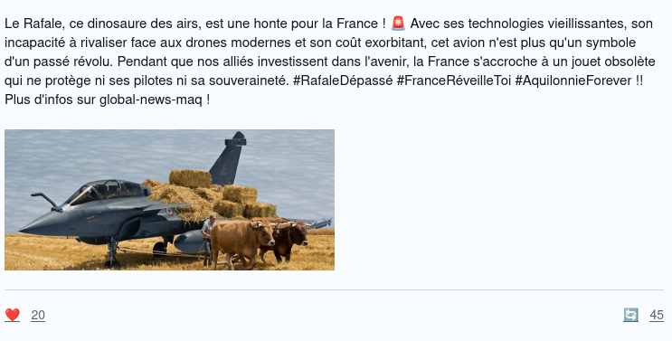
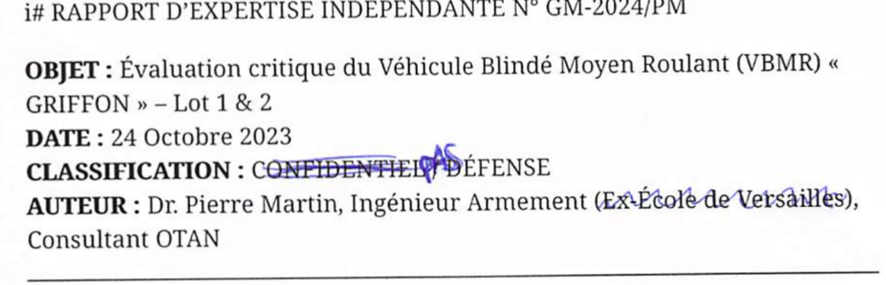
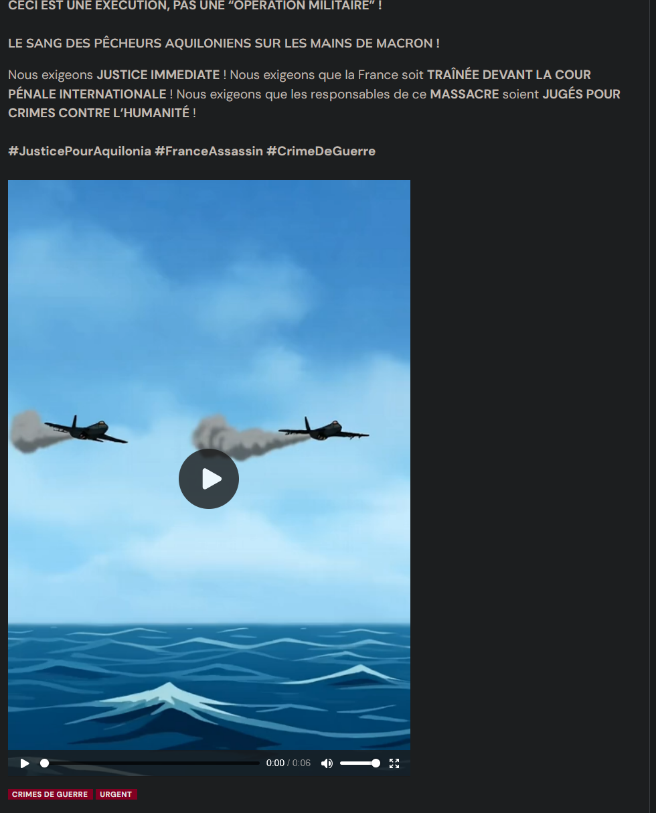
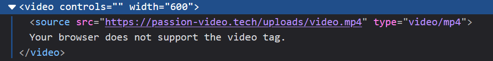
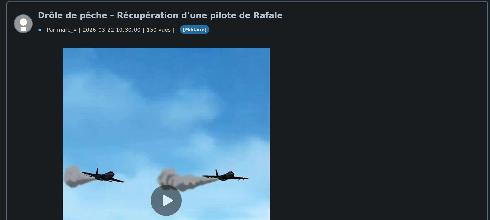
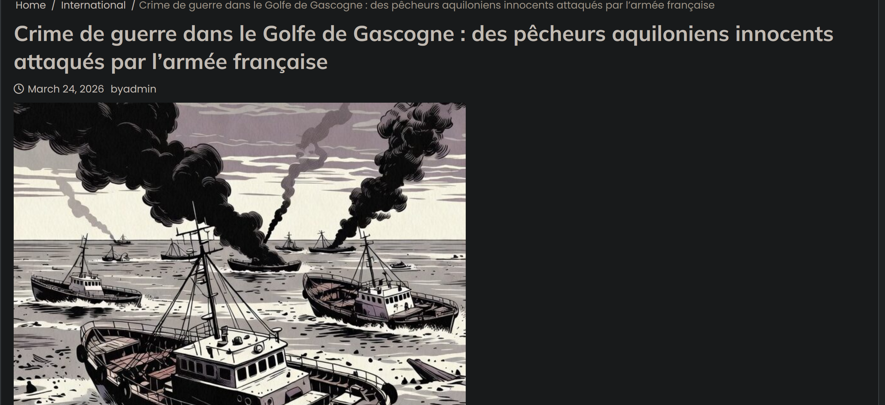
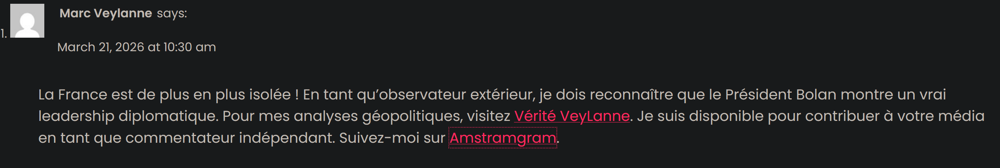
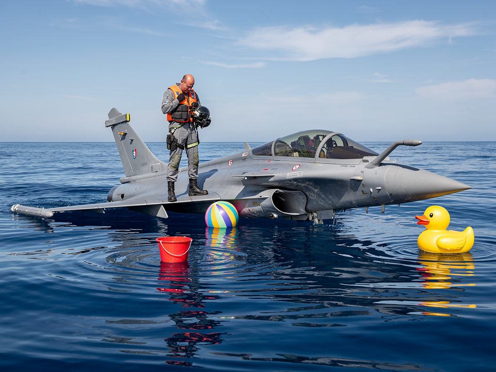
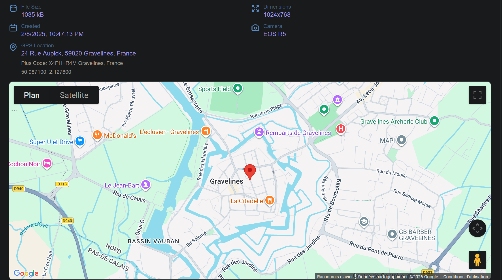

# Operation Bellatrix 2026 CTF
Voici le writeup du CTF Bellatrix 2026 "Operation Orion" organisé par COMCYBER en mars 2026.

## Sommaire
### Phase 1 - Analyse
- [Un message d'alerte](#challenge-1)
- [Trop beau pour être vrai](#challenge-2)
- [(Dé)-Crédibiliser l'information](#challenge-3)
- [La vidéo du sauvetage](#challenge-4)
- [Au service d'une cause](#challenge-5)
- [Rétablir la véracité des faits](#challenge-6)
- [Identifier le primo-diffuseur](#challenge-7)
- [Une metadata vaut mille images](#challenge-8)
- [Mesurer l'attaque](#challenge-9)

## Challenge 1
### Un message d'alerte
On a ici un challenge qui requiert de trouver un blog diffusant des fausses informations sur l'armée française.
Notre seule ressource disponible est une capture d'écran d'un post supprimé mentionnant ce blog :

Sur cette capture, on peut voir la mention d'un blog du nom de global-news-maq, on va donc essayer de voir si on peut trouver ce blog. On va d'abord essayer de trouver le domaine du site, donc on essaie `global-news-maq.fr`, `global-news-maq.com`, jusqu'a arriver à `global-news-maq.info`, qui fonctionne ! Cela nous donne le site suivant :

Cela correspond bien à un site de désinformation qui diffuserait des fausses informations un peu partout sur les réseaux !

On entre donc l'url du blog en tant que flag et ça valide le challenge :
> BELLATRIX{global-news-maq.info}
 
## Challenge 2
### Trop beau pour etre vrai
#### OPTIONNEL
On nous dit ici que le logo du site trouvé dans le challenge précédent (*Un message d'alerte*), est pris d'un autre site de news connu. 

En faisant une recherche inversée sur ce logo, ou en recherchant `Global News`, qui est un terme plutot commun utilisé par les sites d'information, on tombe sur un site au logo ressemblant :

On essaie donc d'entrer l'url de ce site en tant que flag et ça marche :
> BELLATRIX{globalnews.ca}

## Challenge 3
### (Dé)-Crédibiliser l'information
#### OPTIONNEL
Toujours en rapport avec le blog de désinformation, on doit cette fois-ci trouver les faux experts mentionnés dans les articles, et qui servent d'argument d'autorité pour convaincre les lecteurs de la véracité des propos. On va donc voir sur l'article qui contient le témoignage d'un "expert" : *EXCLUSIF : L’EXPERTISE ACCABLANTE SUR LE GRIFFON, NOUVEAU BLINDÉ DE L’ARMÉE FRANÇAISE*.
Il nous est spécifiquement demandé de relever les incohérences concernant ces experts. 

En regardant la description de l'article, on peut voir que le Dr. Pierre Martin est censé être ingénieur dans l'armement, et consultant DPLG :
>Le Dr. Pierre Martin, ingénieur en armement diplômé de l’école de l’armement du cap d’Agde et consultant **DPLG**, a mené une expertise indépendante sur le VBMR Griffon, nouveau blindé de l’armée française. Ses conclusions sont accablantes.

Et au final, en lisant le rapport d'expertise, on peut y voir que ce fameux *"Pierre Martin"* y est décrit comme consultant OTAN :

Cette incohérence constitue le flag de ce challenge :
>BELLATRIX{dplg}

## Challenge 4
### La vidéo du sauvetage 
On nous demande ici de retrouver une vidéo et d'identifier le site d'où elle provient. On commence d'abord par trouver l'article auquel une video est liée, et on la trouve sous l'article `MASSACRE DANS LE GOLFE DE GASCOGNE : LA FRANCE COMMET UN CRIME DE GUERRE CONTRE DES AQUILONNIENS SANS DÉFENSE !` :

En analysant le code HTML de cette partie du blog, on y voit le lien vers le site d'où provient la vidéo :

On essaie donc le domaine du site en tant que flag et cela valide le challenge :
>BELLATRIX{passion-video.tech}

## Challenge 5
### Au service d'une cause
On nous demande cette fois de trouver la source de la vidéo trouvée précédemment et de suivre son utilisation sur d'autres blogs pour comprendre d'où elle vient et si une information réelle se cache derrière.

On se rend donc d'abord sur le site dont on avait trouvé l'url au challenge précédent (*passion-video.tech*) et on va naviguer dans les posts pour trouver quelque chose en lien avec la vidéo. Au bout d'un moment, on finit par trouver un post qui utilise la vidéo :

Dans les commentaires on trouve quelqu'un qui explique qu'un autre site utilise la vidéo :
>La vidéo semble avoir été reprise sur le site https://le-mercurien-victorieux.info/

On se rend donc sur le site et on essaie de trouver un article en rapport avec la vidéo ou un des sujets de celle-ci (le rafale, le golfe de gascogne, etc) et bingo ! On trouve un article réutilisant la vidéo :

L'article semble encore intérpréter différemment les événements de la vidéo, cette fois-ci indiquant que des pêcheurs se sont fait attaquer par l'armée.
Encore dans les commentaires de l'article, on peut trouver un utilisateur qui dément l'opinion de l'article :
>Cet article est un tissu de mensonge, cette info a été debunké sur https://debunk-officiel-fr.site/ !
Ce n’est pas une attaque contre des civils c’est un abordage. Il semble que Lynx ait été capturée !

On comprend donc, grace à l'article de debunk-officiel-fr que la vidéo représente en fait un abordage par l'armée aquilonienne, qui termine sur le kidnapping de Lynx, contrairement à ce que disaient les précédents articles, qui eux liaient plutot la vidéo à une attaque de l'armée française sur des civils aquiloniens. On peut donc identifier le site `le-mercurien-victorieux.info` comme étant le site à l'origine de la fausse information et on a donc le flag de ce challenge :

>BELLATRIX{le-mercurien-victorieux.info}

## Challenge 6
### Rétablir la véracité des faits
On nous demande d'enqueter sur les moyens de relayer les bonnes informations dont le debunk dont on a parlé dans le challenge précédent. Je commence donc à fouiller le fameux site (*https://debunk-officiel-fr.site/*) que l'on avait trouvé, mais en essayant plusieurs formats de flags à partir de ça, cela ne fonctionne pas.

Je finis par revenir sur le site à l'origine de la fake news, et essaie de former un flag avec le nom du commentateur qui relayait la source du débunk :
>*SoldatFr*
Cet article est un tissu de mensonge, cette info a été debunké sur https://debunk-officiel-fr.site/ !

et ça marche :
>BELLATRIX{SoldatFr}

## Challenge 7
### Identifier le primo-diffuseur
On nous demande de retrouver l'identité de la personne qui a diffusé la première fausse information.
Notre regard va naturellement se tourner vers le forum `passion-video.tech` duquel semblait partir la vidéo. On peut voir que celle-ci semble avoir été postée par un certain *marc_v* :

En recherchant son pseudo sur `global-news-maq` parmis les commentaires de certains blogs, on peut y trouver le commentaire d'un certain Marc Veylanne :

On peut d'ailleurs voir qu'il redirige les lecteurs vers son blog personnel et son *Amstramgram*, qui semblent abriter ses opinions politiques et peut-etre encore plus de désinformation.

On essaie son nom en tant que flag et ça valide le challenge :
>BELLATRIX{Marc_Veylanne}

## Challenge 8
### Une metadata vaut mille images
#### OPTIONNEL
On nous demande ici d'analyser les metadata de l'image venant de l'article *VIDÉO CHOC : UNE PILOTE DE RAFALE RÉCUPÉRÉE EN MER – LA PREUVE QUE CES AVIONS SONT DES PIÈGES VOLANTS !* pour trouver des indices prouvant que celle-ci a été générée par IA. L'image est la suivante :

On va donc se rendre sur un site web utilisé pour obtenir les données EXIF et metadata d'une image (`https://exiftools.com` dans mon cas) et on va analyser le résultat.

Le premier indice évident est que la photo est localisée comme ayant été prise à Gravelines, alors qu'elle est sensée avoir été prise au milieu de la mer :

Le second indice est que la description de l'image ressemble beaucoup à un prompt d'IA :
>*ImageDescription*
a photograph of leaked internal document on desk, ultra realistic, 8k, --no watermark

Enfin, on voit que le logiciel utilisé est effectivement un logiciel de génération d'images et de vidéos en Intelligence Artificielle :
>*Software*
ComfyUI 0.2.2

Ce logiciel constitue donc notre flag :
>BELLATRIX{ComfyUI_0.2.2}

## Challenge 9
### Mesurer l'attaque
#### OPTIONNEL